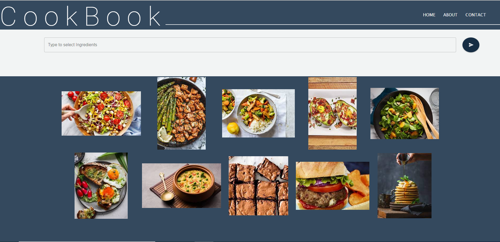
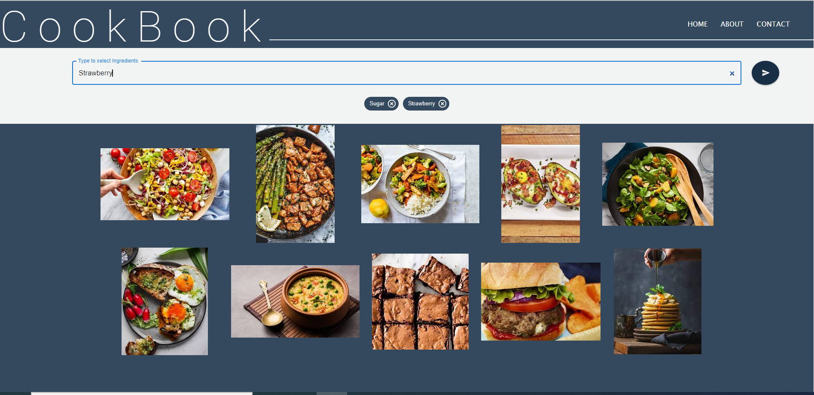
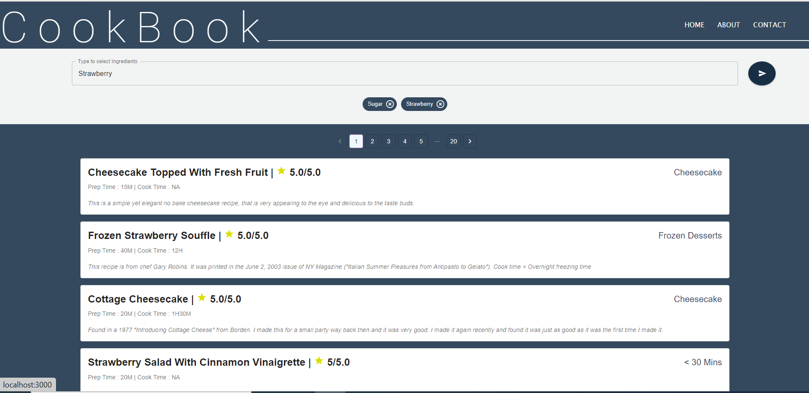
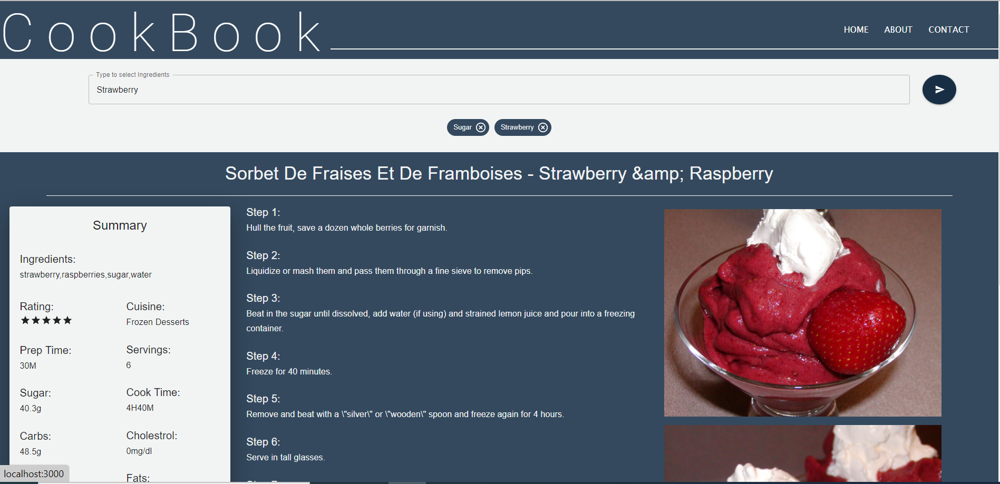
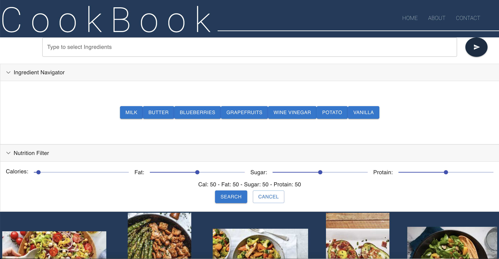
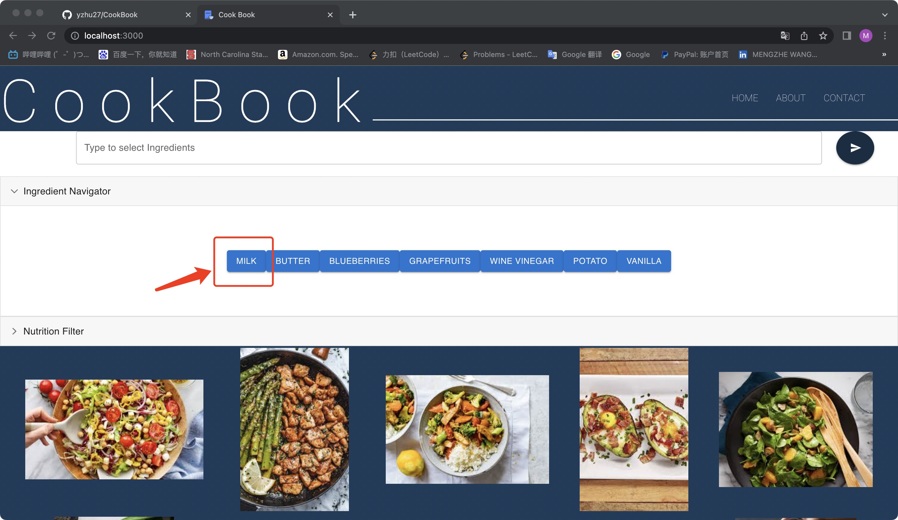
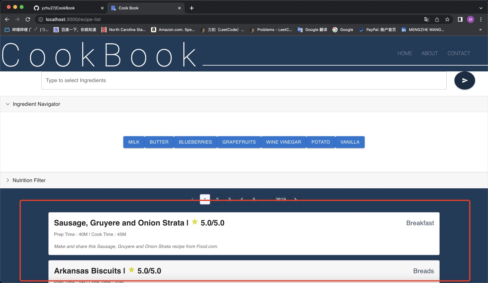
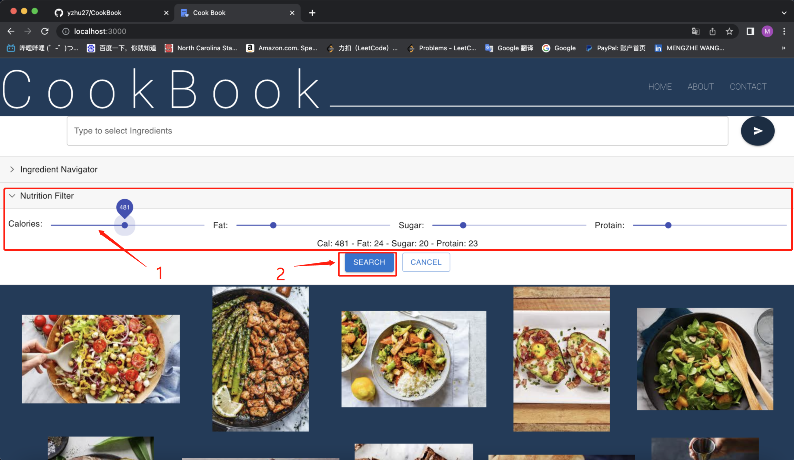
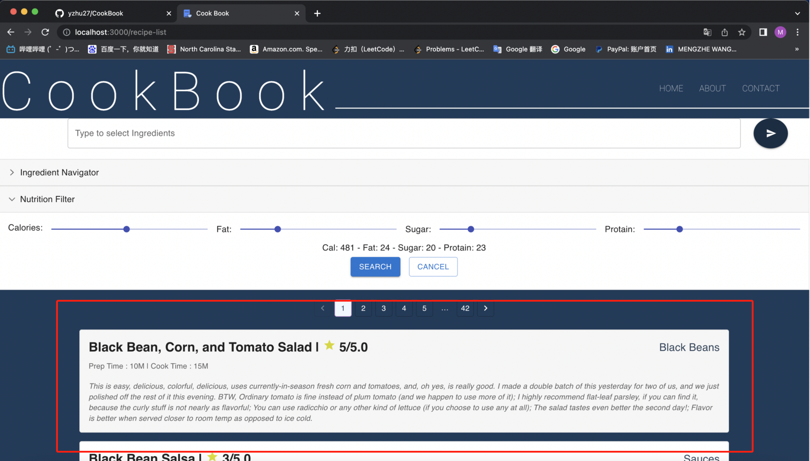
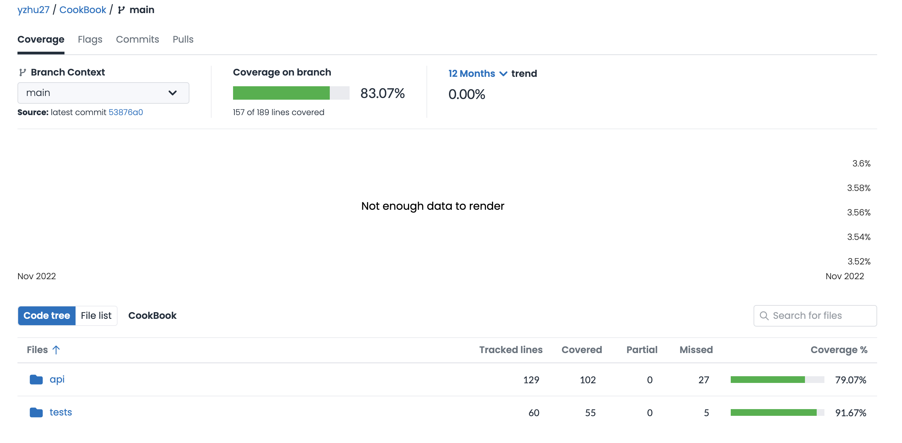

<p align="center"></p>

<div align="center">

[](https://opensource.org/licenses/MIT)

[](https://zenodo.org/badge/latestdoi/541238337)


[](https://app.codecov.io/gh/yzhu27/CookBook) <br/>


</div>
<br><br>

# What is Cook Book ?

CookBook is a platform to search for recipes that can be made using the available ingredients.

- **Easy**: CookBook is a very user friendly website, where you can just enter the ingredients available and the platform will suggest various recipes that can be made using these ingredients.

- **Convenient**: Apart from saving you from the dilemma of deciding what to cook, it is meant to make your cooking experience convenient by suggesting detailed step-by-step recipes.

- **Flexible**: You can add as little or as many ingredients as you want.

With over recipes, there is something in the store for everyone !<br><br>

# Content

<p align="center">
    |
    <a href="#whats-new">What's New</a>
  |
  <a href="#installations">Installations</a>
  |
  <a href="#examples">Examples</a>
  |
  <a href="#style-checker-and-code-fomatter">Style Checker & Code Fomatter</a>
  |
  <a href="#code-coverage">Code Coverage</a>
  |
  <a href="#why-cookbook">Why CookBook?</a>
  |
   <a href="#meet-the-team">Team</a>
  |
  <a href="#support">Support</a>
  |
  
</p><br><br>

# Demo

<p align="center"></p><br><br>

# What's New?
[](https://www.youtube.com/watch?v=swfG0uig19c "improvements introduction")

## New features:

- Make CookBook come online as a website: [Cook Book](https://cook-book.ml) Users don't need to install the backend and frontend anymore.
- Add filtering system based on nutrition.
- Created ingredient tags to simplify the searching.


## Better Software Design

- Improved the scalability by [CDN](https://github.com/yzhu27/CookBook/blob/main/docs/Scalability.md#content-delivery-network), [Load Balancing](https://github.com/yzhu27/CookBook/blob/main/docs/Scalability.md#load-balancing-on-cloudflare). [Cache](https://github.com/yzhu27/CookBook/blob/main/docs/Scalability.md#cache), etc.
- Improved the safety by [Domain](https://github.com/yzhu27/CookBook/blob/main/docs/Safety.md#domain), [SSL/TSL](https://github.com/yzhu27/CookBook/blob/main/docs/Safety.md#ssltls), [DDoS Protection](https://github.com/yzhu27/CookBook/blob/main/docs/Safety.md#ddos-protection).
# Installations

## Access the website
Access this link [Cook Book](https://cook-book.ml).

### Trouble Shooting
If this page failed, try to change your network environment. Typically, we noticed some DNS resolve failures under NC State network. That may caused by NCSU's DNS server problem. You may try your home network or mobile hotspot instead.

If you still fail to load the site, try the following steps.

## Backend Installation

To set up the back end, do:<br>
Make sure you are in the base folder.<br><br>
In order to run the application server, run the following commands:

```bash
cd api
pip install -r requirements.txt
python -m uvicorn main:app --reload
```

Refer to the [Swagger](#swagger) section for sample API calls.
<br>

### Trouble Shooting

In case you run into any issues running the above commands, some operating systems may require you to use `python3` instead of `python` and `pip3` instead of `pip`.<br><br>

## Frontend Installation

To set up the front end React app, do:<br>

```bash
cd frontend
npm install

// if npm install fails, try this
npm install --legacy-peer-deps
```

<br>

## To run the front end React app, do:

```bash
cd frontend
npm start
```

<br>

# Examples

## Old Functions
- This is the CookBook HomePage that should automatically open in a browser after executing the command: 'npm start'
  <br><br>



<br>

- The user can use the search bar to enter the ingredients one by one, and then proceed by clicking the arrow on the right.
  <br><br>



<br>

- The user would then be redirected to the page showing the recipe suggestions.
  <br><br>



<br>

- The details of a recipe can be viewed by simple clicking on a recipe from the list of recipes being displayed.
  <br><br>



<br><br>

## New Functions Tutorials

- Start the App by URL.


<br>


- Above content mentions that users may manually input keyword, and click on 'search tag' to create some keyword search tags to search recepies. Besides, users may also click on some "food tags" to search receipes without specific input. For example, we may select "milk" tag:



<br>

- Then, we may have results shown as below:



<br>

- What is more, if users are not sure that tags to be chosen, they are able to use sliders to set some values for [Calorie, Fat, Suger, Protain]. The filtered recepies will be shown after using this kind of search. For example, if we want receipes that fulfill some requirements as:



<br>

- As former example cases, filtered results are displayed:



# Style Checker and Code Fomatter

- IDE and Style Checker: [VSCode](https://code.visualstudio.com/)

- Code Style Formatter: [Beautify](https://marketplace.visualstudio.com/items?itemName=HookyQR.beautify)

- Code Syntax Checker : [Eslint](https://https://marketplace.visualstudio.com/items?itemName=dbaeumer.vscode-eslint) for Vscode plugin.

Following extensions have to be added to you VS Code editor:

- For Eslint: Install - dbaeumer.vscode-eslint
- For Prettier: Install - esbenp.prettier-vscode
- Update the settings.json of your VS Code editor to include these statements (you can add them to your existing ones):

```bash

{
  "editor.defaultFormatter": "esbenp.prettier-vscode",
  "eslint.alwaysShowStatus": true,
  "editor.formatOnSave": true,
  "editor.codeActionsOnSave": {
    "source.fixAll.eslint": true
  },
  "[json]": {
    "editor.defaultFormatter": "esbenp.prettier-vscode",
    "editor.formatOnSave": true
  }
}

```

# Code Coverage
[Codecov](https://app.codecov.io/gh/yzhu27/CookBook)


# Why CookBook?

- Most of us might have been in a situation where you are craving for something to eat and due to some reason it won't be delivered to your place. And then you decide to cook it yourself you can't find a recipe with the ingredients you have.
- In this fast-paced world, we are often confused about what can be cooked with the ingredients that are available right away.
- CookBook addresses this issue and is designed to suggest recipes to you which would use the key ingredients that are available with you.
- It not only suggests the recipe based on the ingredients entered by you, it also gives the ratings, step-by-step cooking instructions and other granular details about the recipe.
- Apart from giving the user a smooth and a stress-free experience, it also serves as a platform to find recipes across multiple cuisines and cultures.
- The interface of CookBook is somewhat similar to most of the search-engines, giving a sense of familiarity to the user. The user would have to just enter the available ingredients in a search bar and click on the proceed icon to get a list of suggestions for recipes.

# Meet the Team

## Version 1.0


## Version 2.x
- Pinxiang Wang
- Yuheng Zhu
- Mengzhe Wang
- Jiayuan Huang
- Yiran Zhu

# Support
You can find the dataset used for this project [here](https://drive.google.com/file/d/12CZFb7Ugmiw9zQ7M_qpRsn7pmaV1zW0c/view?usp=sharing)

In case of any queries and for additional help, please email us at: help.cookbook@gmail.com

```
CookBook
├─ .DS_Store
├─ .git
│  ├─ COMMIT_EDITMSG
│  ├─ FETCH_HEAD
│  ├─ HEAD
│  ├─ ORIG_HEAD
│  ├─ branches
│  ├─ config
│  ├─ description
│  ├─ hooks
│  │  ├─ applypatch-msg.sample
│  │  ├─ commit-msg.sample
│  │  ├─ fsmonitor-watchman.sample
│  │  ├─ post-update.sample
│  │  ├─ pre-applypatch.sample
│  │  ├─ pre-commit.sample
│  │  ├─ pre-merge-commit.sample
│  │  ├─ pre-push.sample
│  │  ├─ pre-rebase.sample
│  │  ├─ pre-receive.sample
│  │  ├─ prepare-commit-msg.sample
│  │  ├─ push-to-checkout.sample
│  │  ├─ sendemail-validate.sample
│  │  └─ update.sample
│  ├─ index
│  ├─ info
│  │  └─ exclude
│  ├─ logs
│  │  ├─ HEAD
│  │  └─ refs
│  │     ├─ heads
│  │     │  ├─ deployment
│  │     │  ├─ feature
│  │     │  │  ├─ sharing
│  │     │  │  └─ voice
│  │     │  ├─ main
│  │     │  └─ testing
│  │     └─ remotes
│  │        └─ origin
│  │           ├─ HEAD
│  │           ├─ deployment
│  │           ├─ feature
│  │           │  ├─ custom-recipe
│  │           │  ├─ sharing
│  │           │  └─ voice
│  │           ├─ main
│  │           └─ testing
│  ├─ objects
│  │  ├─ 05
│  │  │  └─ e0965be70269e9d0e80b4a7abcd19cee5045aa
│  │  ├─ 0b
│  │  │  └─ 3319b88eb440710814e313a0a0ec5af41a83cc
│  │  ├─ 0d
│  │  │  └─ ff004f27b6e45498cbf98849a09a1a6af9874c
│  │  ├─ 0e
│  │  │  └─ 94498776b5f0afd22be43a380e9ecbac725047
│  │  ├─ 12
│  │  │  └─ dfb43a249310457988157ac56bcf7ee1156374
│  │  ├─ 1c
│  │  │  └─ 9c24ec1a7f026f7cef4fb6f8abb431d4079fc5
│  │  ├─ 1d
│  │  │  └─ 0b4eb0ad5ea8fa4f2fa85fbf3b281dbb1b41b7
│  │  ├─ 1f
│  │  │  └─ 885a64eb4ad8eacb492ce1da01b557b23b19b5
│  │  ├─ 21
│  │  │  └─ b395ebc3bc7eaba702fa32badf955b2ea69958
│  │  ├─ 23
│  │  │  └─ a58ac52d9211d707e1ac0ec484736c5809bc2e
│  │  ├─ 27
│  │  │  └─ bc5baa52acca8ad0f3a0321a0957458de1675e
│  │  ├─ 28
│  │  │  └─ e92174ac0219af02b7f9a124f54a4e46a4f3a6
│  │  ├─ 2a
│  │  │  └─ 02c6a9003c06e0eb63232bca3d526a95c93095
│  │  ├─ 2b
│  │  │  └─ 79db553eecee4bea5cacd328834d8705b45aa7
│  │  ├─ 2c
│  │  │  ├─ 20e3def01cf18f20987259a3d859b4aa8f5f9d
│  │  │  └─ ee3a95364a8844f0433e5213c4c7b22e66f80f
│  │  ├─ 2d
│  │  │  └─ 9a284218a2ef36de0897f8bd40d9ba9fd2743a
│  │  ├─ 33
│  │  │  └─ 89e18869d320d3a1b5dc4b4f6aaa2ba3688c90
│  │  ├─ 35
│  │  │  └─ 5047b0ddb8cea63068b0ccd64b9365cfa2df9c
│  │  ├─ 38
│  │  │  └─ 5df5b7d9247910d69f0ecc50c8a5e2be19f8c7
│  │  ├─ 3a
│  │  │  └─ d62964ed81b6697f6c7218a6c9ca5fe8a7a351
│  │  ├─ 3b
│  │  │  └─ 302566fe62c27c8ce825f6d64286cd011e213d
│  │  ├─ 3f
│  │  │  └─ 2367dc9f0bf3a4cc7f2d42b5b485a2932115d2
│  │  ├─ 43
│  │  │  └─ 9ada9155dd5c1da0181bf8e6e071cb5c435e35
│  │  ├─ 45
│  │  │  ├─ 08d6f2117f9bd57e21e482f675817c60e30078
│  │  │  ├─ eecb95e928111642f35a0fda1e9fb35f84dc87
│  │  │  └─ eeeea6f81bf2451b45891eb49852b2d6d79c0f
│  │  ├─ 4e
│  │  │  └─ b258465db79cd4771e33ed907371c5a334f480
│  │  ├─ 4f
│  │  │  └─ 1142f5630b93c095998e437e1a2bd20b607e94
│  │  ├─ 50
│  │  │  └─ 12b8fc470a0bfbce2cec7238e7a351a76ce7fc
│  │  ├─ 55
│  │  │  └─ 17db073566a2a557375d6ddb9ddafb488cc5c9
│  │  ├─ 56
│  │  │  └─ 465aec48cfe99f1102b7fd68f95ea016edebe0
│  │  ├─ 57
│  │  │  ├─ 8c8a608d48133177e145cbf2e59f9acbe1d21e
│  │  │  └─ cef333e32cc136fe715103bf37c9100197ec79
│  │  ├─ 5a
│  │  │  └─ 3eee8dac34dbbc230490e664670d49e9a24490
│  │  ├─ 5b
│  │  │  └─ ebb86cf4099e14503daaad9d8d3ef0446611cf
│  │  ├─ 5e
│  │  │  └─ c9021186b01b24c9adb84708079f58151a3e03
│  │  ├─ 62
│  │  │  └─ 49314f7b1d3a425b459964d54a49a6e1802601
│  │  ├─ 63
│  │  │  └─ 7b7f066d93d871872fab0654a371e02ac415b1
│  │  ├─ 64
│  │  │  └─ 0e0ef369946319891bbf6f37c7c803faafa516
│  │  ├─ 73
│  │  │  └─ fe86be6ada884538f65e3d8e55048cd254a797
│  │  ├─ 7c
│  │  │  └─ 31b0872a6fe49e72423d3ad7017a71eba0570b
│  │  ├─ 82
│  │  │  └─ 2df5e946e036b77730d86d6476b4d8819820e1
│  │  ├─ 84
│  │  │  └─ 03357d66ff432d5d5a3cfb0f0322104d379f83
│  │  ├─ 86
│  │  │  └─ fd607e06ed348d5a51318fddbb937548cc6e4c
│  │  ├─ 88
│  │  │  └─ 7b8d72e8c2d7422b0376bd37b16391176e8b00
│  │  ├─ 89
│  │  │  └─ 708ed1661d80ecc4010ba346df8207d06de455
│  │  ├─ 8a
│  │  │  └─ 71c83e5df64559b56e7af5e25f8d357b4b9e07
│  │  ├─ 8e
│  │  │  └─ 45ca7105f3836da20768d67a35c5c5ffc64bb5
│  │  ├─ 8f
│  │  │  ├─ 8a4a71e58a1e2c164c0b73a1ee623e6ed424a6
│  │  │  └─ baeca88855919dd266975e786a7269e55eba3c
│  │  ├─ 92
│  │  │  └─ c6daa84c49571b9aa61281c88ee210ead16e08
│  │  ├─ 93
│  │  │  └─ d8ccb1f59ef71e7b233dd34e4e2f117e42452a
│  │  ├─ 94
│  │  │  └─ 76207bb81ee44dbafad15cfb50de1a51283bc4
│  │  ├─ 95
│  │  │  └─ 08aac5b04a69782dfbeac1630ea7d57fbe26b3
│  │  ├─ 96
│  │  │  └─ 9129c099b42928c06cd01035067eca7facf56b
│  │  ├─ 97
│  │  │  └─ fc547d726b2ea87da271952e03fa659b4d75a8
│  │  ├─ 98
│  │  │  └─ 05126010b269bf288173db7623eaebc27ca1f1
│  │  ├─ 9c
│  │  │  └─ 997bee6ba58d20dcf3c678eebe1017d0c888e7
│  │  ├─ 9e
│  │  │  └─ 1dc1c0085312c944af86e3777e14eb88430b5c
│  │  ├─ a0
│  │  │  └─ 505556f638908eed62296a05ea19a9016bdd54
│  │  ├─ a5
│  │  │  └─ 9bbd4ded2aff28877e486141ed444419061b1d
│  │  ├─ a6
│  │  │  └─ f9da8d99465ec2b09e9af5adb984cd576bdb8a
│  │  ├─ a8
│  │  │  └─ 7d925906dd12e0e33d9bdb4ad50303a20928af
│  │  ├─ aa
│  │  │  └─ 42eb78e014d5916c16853d7713e591ed878178
│  │  ├─ ac
│  │  │  └─ 2f6c8814a74213fff124db7aabbc88ec3b3846
│  │  ├─ ae
│  │  │  └─ 2e39f23f2834d54a5d18dbc90e3cda3d00d201
│  │  ├─ af
│  │  │  ├─ 5706c29b537769ed01b173e62c12c7a09f255e
│  │  │  └─ f0407fa24f199085fc2ca399cd04698dab9dc1
│  │  ├─ b0
│  │  │  └─ d4d2e31be48d5245abc85a94052adc7111cadb
│  │  ├─ b2
│  │  │  └─ ee1df41a9ef6394b7c4f2832e436eee822ae2a
│  │  ├─ b4
│  │  │  └─ 43203e19ff74b71be21af72474e6033867d62e
│  │  ├─ b6
│  │  │  └─ ca86dacf42818d6f5e199d925db43676e62f85
│  │  ├─ ba
│  │  │  ├─ 0974b2e7a07a77153f9c777cfdd4b5251104b3
│  │  │  └─ 5c9c50582c1141dd237337321105cb9bcf1c30
│  │  ├─ be
│  │  │  └─ 1cdc8366f2b7562308ec152a69a774e0d62589
│  │  ├─ bf
│  │  │  └─ 2266d1193d4b0369743b2074054bf0e446e95f
│  │  ├─ c2
│  │  │  ├─ 6e9936d970b54f8e422c7538735bad3a93ff32
│  │  │  └─ cb2b753ec6664caceee8a6c2079243ee19bd6a
│  │  ├─ c4
│  │  │  └─ c35c40fc479461d898bbf13a3294b588870404
│  │  ├─ c9
│  │  │  └─ e9ef1c2e1fb2337c263cd33095573e91c932c2
│  │  ├─ cd
│  │  │  └─ 735018cba96ad337385e3666ea395f83e889ab
│  │  ├─ cf
│  │  │  └─ f3fc8f9916aa6ea1b4b97237168ca0bca71048
│  │  ├─ d2
│  │  │  └─ 40aa4500e7c05b0a475cf57115abb4c3ee49a1
│  │  ├─ d6
│  │  │  └─ ddd185635923c19a76d0a38bd66de0874399d4
│  │  ├─ db
│  │  │  ├─ 289e152c510a1feaa873bfcfcbc71afb548192
│  │  │  ├─ 2fb59dac5993906dbf0d712d9c28c0a867ee08
│  │  │  └─ 574e4410c6139964f7097e9483f6e18a1e80a7
│  │  ├─ dd
│  │  │  └─ c3e50fa76cf9f43532b6d9170f8b8abf9dd341
│  │  ├─ e1
│  │  │  └─ f5461b9a857e1592e6ead0387e856a9572239f
│  │  ├─ e2
│  │  │  └─ 624a1ef480ff481ea9355ae657e3f59e38386d
│  │  ├─ e4
│  │  │  └─ 6c17f5660215efa2296bc8842abdc3df74e6b8
│  │  ├─ e6
│  │  │  └─ 2c7589183ccaecccd1f603d02abe68ec51fea7
│  │  ├─ e7
│  │  │  ├─ 712e1b3fc982c63bf3900f167db4a128b99fcb
│  │  │  └─ 98ae6feeefec68ff154574fe6ee8b85c6badf9
│  │  ├─ ea
│  │  │  └─ 39a3ed6c9af3449f26a82a265ce23b53273b67
│  │  ├─ ee
│  │  │  └─ 50c4157b92ba1a5ed5b7f84cc0173cdb878626
│  │  ├─ ef
│  │  │  └─ d3b43ad008caac2176b0cc00a809df69c0ae27
│  │  ├─ f6
│  │  │  └─ 0368f89ab89ac1c06cd8a7ecedcc157b3ec588
│  │  ├─ fa
│  │  │  ├─ 81f02fff8948545949813a00a39eabaaadd9e6
│  │  │  └─ d083da3df884b22975a34cf43dad821edb56a5
│  │  ├─ fb
│  │  │  └─ 58b6fcd36eb073621a612501f45ec4d39d162f
│  │  ├─ fc
│  │  │  └─ 3efe393c5ef63c5dd47335eecf0497cbac209a
│  │  ├─ info
│  │  └─ pack
│  │     ├─ pack-120a108bc00379b2f122869f8014cfe85126262e.idx
│  │     ├─ pack-120a108bc00379b2f122869f8014cfe85126262e.pack
│  │     └─ pack-120a108bc00379b2f122869f8014cfe85126262e.rev
│  ├─ packed-refs
│  └─ refs
│     ├─ heads
│     │  ├─ deployment
│     │  ├─ feature
│     │  │  ├─ sharing
│     │  │  └─ voice
│     │  ├─ main
│     │  └─ testing
│     ├─ remotes
│     │  └─ origin
│     │     ├─ HEAD
│     │     ├─ deployment
│     │     ├─ feature
│     │     │  ├─ custom-recipe
│     │     │  ├─ sharing
│     │     │  └─ voice
│     │     ├─ main
│     │     └─ testing
│     └─ tags
├─ .github
│  └─ workflows
│     ├─ node.js.yml
│     ├─ python-app.yml
│     └─ workflow.yml
├─ .gitignore
├─ CITATION.cff
├─ CODE_OF_CONDUCT.md
├─ CONTRIBUTING.md
├─ LICENSE
├─ README.md
├─ api
│  ├─ Dockerfile
│  ├─ __init__.py
│  ├─ main.py
│  ├─ models.py
│  ├─ requirements.txt
│  └─ routes.py
├─ assets
│  ├─ HomePage.PNG
│  ├─ HomePage_new.png
│  ├─ RecipeDetails.PNG
│  ├─ SearchBar.PNG
│  ├─ SearchResults.PNG
│  ├─ codecov.png
│  ├─ demo.gif
│  ├─ filterSearch1.png
│  ├─ filterSearch2.png
│  ├─ logo.png
│  ├─ tagSearch1.jpg
│  ├─ tagSearch2.jpg
│  ├─ team_edit.png
│  ├─ video1.m4v
│  └─ video2.m4v
├─ docker-compose.yml
├─ docs
│  ├─ Home.css
│  ├─ Safety.md
│  ├─ Scalability.md
│  ├─ api
│  │  ├─ main.html
│  │  ├─ models.html
│  │  └─ routes.html
│  ├─ api.html
│  ├─ components.html
│  ├─ images
│  │  ├─ 4a08d1b7-15a5-0eed-0f9f-0c0337f05c03.jpg
│  │  ├─ 8750c800-0485-f790-5fdc-5a8cf409301e.jpg
│  │  ├─ SSL.png
│  │  ├─ cache.png
│  │  ├─ cdn.png
│  │  ├─ e6fab1f1-ae30-31cf-b73f-aa548e18d0f4.jpg
│  │  ├─ fgfgfg4.jpg
│  │  ├─ load.png
│  │  ├─ load_balancing.png
│  │  ├─ screenshot1.png
│  │  └─ screenshot2.png
│  ├─ index.html
│  ├─ jquery.js
│  ├─ nicepage.css
│  ├─ nicepage.js
│  ├─ proj1rubric.md
│  ├─ proj1rubricComments.pdf
│  ├─ proj2rubric.md
│  ├─ search.js
│  └─ style
│     ├─ accordian.pack.js
│     └─ style.css
├─ frontend
│  ├─ .eslintignore
│  ├─ .eslintrc.json
│  ├─ .gitignore
│  ├─ .prettierignore
│  ├─ .prettierrc.json
│  ├─ .vscode
│  │  └─ settings.json
│  ├─ Dockerfile
│  ├─ README.md
│  ├─ package-lock.json
│  ├─ package.json
│  ├─ public
│  │  ├─ favicon.ico
│  │  └─ index.html
│  ├─ src
│  │  ├─ App.css
│  │  ├─ App.test.tsx
│  │  ├─ App.tsx
│  │  ├─ features
│  │  │  ├─ AppContent
│  │  │  │  ├─ AppContent.tsx
│  │  │  │  ├─ HomePage
│  │  │  │  │  ├─ AboutPage.tsx
│  │  │  │  │  ├─ ContactPage.tsx
│  │  │  │  │  ├─ HomePage.css
│  │  │  │  │  ├─ HomePage.test.tsx
│  │  │  │  │  ├─ HomePage.tsx
│  │  │  │  │  └─ photos
│  │  │  │  │     ├─ eighth.jpg
│  │  │  │  │     ├─ fifth.jpg
│  │  │  │  │     ├─ first.jpg
│  │  │  │  │     ├─ fourth.jpg
│  │  │  │  │     ├─ logo.png
│  │  │  │  │     ├─ nineth.jpg
│  │  │  │  │     ├─ second.jpg
│  │  │  │  │     ├─ seventh.jpg
│  │  │  │  │     ├─ sixth.jpg
│  │  │  │  │     ├─ tenth.jpg
│  │  │  │  │     └─ third.jpg
│  │  │  │  ├─ NutritionFilter
│  │  │  │  │  └─ CustomizedAccordions.tsx
│  │  │  │  ├─ RecipeInformation
│  │  │  │  │  ├─ RecipeInformation.css
│  │  │  │  │  ├─ RecipeInformation.test.tsx
│  │  │  │  │  ├─ RecipeInformation.tsx
│  │  │  │  │  ├─ getRecipeInformation.action.ts
│  │  │  │  │  ├─ getRecipeInformation.actionTypes.ts
│  │  │  │  │  ├─ getRecipeInformation.reducer.ts
│  │  │  │  │  ├─ getRecipeInformation.saga.ts
│  │  │  │  │  └─ no-image.png
│  │  │  │  ├─ RecipeList
│  │  │  │  │  ├─ RecipeList.css
│  │  │  │  │  ├─ RecipeList.tsx
│  │  │  │  │  ├─ getRecipeList.action.ts
│  │  │  │  │  ├─ getRecipeList.actionTypes.ts
│  │  │  │  │  ├─ getRecipeList.reducer.ts
│  │  │  │  │  └─ getRecipeList.saga.ts
│  │  │  │  └─ Tag
│  │  │  │     ├─ GetTags.tsx
│  │  │  │     ├─ TagList.css
│  │  │  │     ├─ getTagList.action.ts
│  │  │  │     ├─ getTagList.actionTypes.ts
│  │  │  │     ├─ getTags.reducer.ts
│  │  │  │     └─ getTags.saga.ts
│  │  │  ├─ GetIngredients
│  │  │  │  ├─ GetIngredients.tsx
│  │  │  │  ├─ getIngredients.action.ts
│  │  │  │  ├─ getIngredients.actionTypes.ts
│  │  │  │  ├─ getIngredients.reducer.ts
│  │  │  │  └─ getIngredients.saga.ts
│  │  │  ├─ Header
│  │  │  │  ├─ Header.css
│  │  │  │  ├─ Header.test.tsx
│  │  │  │  └─ Header.tsx
│  │  │  ├─ Navbar
│  │  │  │  ├─ Navbar.css
│  │  │  │  ├─ Navbar.test.tsx
│  │  │  │  └─ Navbar.tsx
│  │  │  ├─ apiMethods.ts
│  │  │  ├─ features.reducer.ts
│  │  │  └─ features.saga.ts
│  │  ├─ fonts
│  │  │  ├─ Roboto-Regular.ttf
│  │  │  └─ Roboto-Thin.ttf
│  │  ├─ index.css
│  │  ├─ index.tsx
│  │  ├─ logo.svg
│  │  ├─ react-app-env.d.ts
│  │  ├─ reportWebVitals.ts
│  │  ├─ setupTests.ts
│  │  └─ store.ts
│  └─ tsconfig.json
└─ tests
   ├─ .env
   ├─ coverage.xml
   ├─ sliderCollections.tsx
   └─ test_routes.py

```