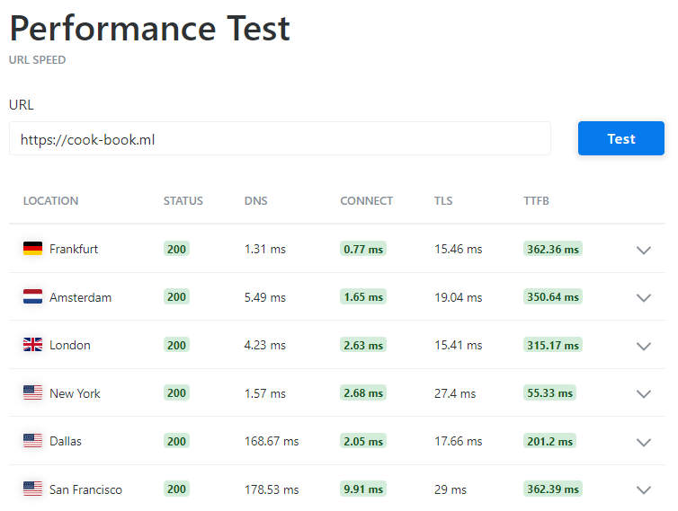
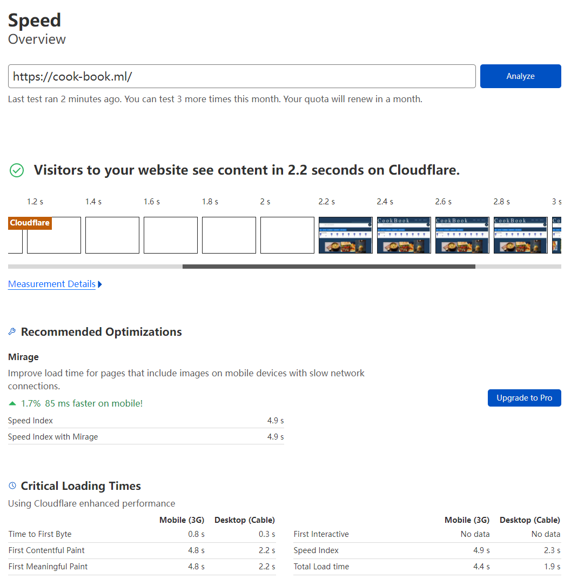
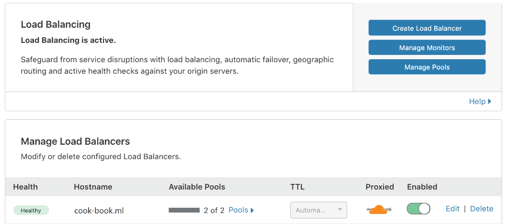
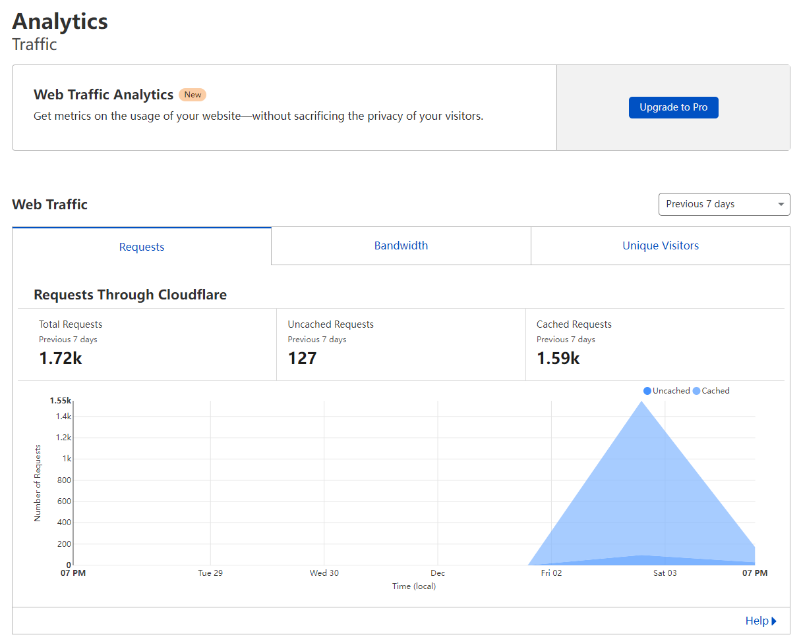

# Scalability

[Cook Book](https://cook-book.ml/) uses multiple approaches to extend scalability and capacity, to increase throughput and support large concurrent traffic. We can't directly quantify the work we've done to increase concurrency because all freely available quantify testing tools will be identified as network attacks on this site, so we'll show what we've done on scalability in the following areas:

## Content Delivery Network

[Cook Book](https://cook-book.ml/) is now partnering with [Cloudflare®](https://www.cloudflare.com/) to improve performance, reduce load times, and lower costs through Cloudflare's ultra-fast static and dynamic content delivery.



Connect time from worldwide are less than 10ms.



Loading time is faster than before on Cloudflare.

## Load Balancing

[Cook Book](https://cook-book.ml/) uses load balancing to distribute incoming traffic across multiple server instances.

### Load Balancing on [Cloudflare®](https://www.cloudflare.com/)

[Cook Book](https://cook-book.ml/) implements traffic load balancing on Cloudflare to distribute traffic dynamically into two server pools.



### Load Balancing on Nginx

[Cook Book](https://cook-book.ml/) also implements Nginx HTTP load balancing on each server instance with multiple service threads running:

```
upstream cookbookserver {
    least_conn;
    server 194.*.*.197:***0;
    server 194.*.*.197:***1;
    server 194.*.*.197:***2;
}
```

When a request is sent to the server, Nginx will distribute it to the thread with the least number of active connections.

## Cache

[Cook Book](https://cook-book.ml/) uses Cloudflare's cache service to store a copy of static content on the servers of Cloudflare's globally distributed data centers. This makes [Cook Book](https://cook-book.ml/) is far more faster than before.



## Other Approaches

[Cook Book](https://cook-book.ml/) also uses following techniques to accelerate your experience:

- **HTTP/2 to origin**: Including Connection Multiplexing, HTTP Header Compression and HTTP/2 Server Push.

- **HTTP/3 (with QUIC)**: Accelerates HTTP requests by using QUIC, which provides encryption and performance improvements compared to TCP and TLS.

- **0-RTT Connection Resumption**: 0-RTT Connection Resumption allows the client’s first request to be sent before the TLS or QUIC connection is fully established, resulting in faster connection times, when the client is resuming a connection that was previously already established.

- **IPv6 Compatibility**

- **Brotli**: A compression algorithm to speed up page load times.

- ...
